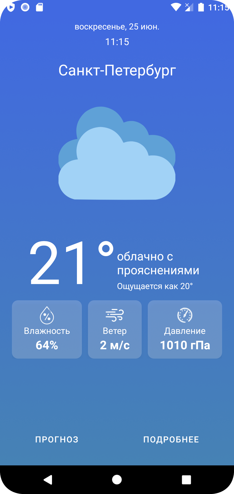

# TestWeatherApp
The weather app for Android, implemented using Kotlin, allows users to get instant access to weather data in St. Petersburg (current weather, current weather details, weather forecast for 5 days every 3 hours) via openweathermap API.
## Sreenshots
Splash Activity|Main Activity|Details Activity|Forecast Activity
----|----|----|----
   |  |   | 

